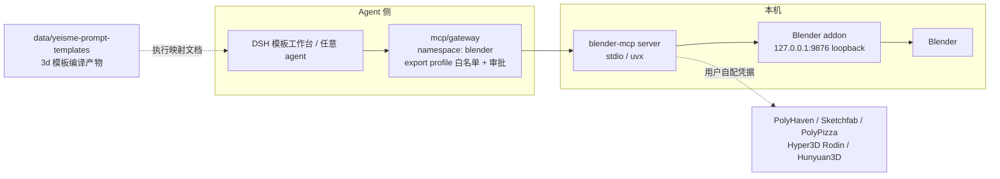

# Blender MCP Yeisme 集成设计

## 决策

1. **fork 复用，不自建**：上游（Python server + Blender addon）整体保留，Yeisme 改动以 additive 为主（分级元数据、配置示例、文档），不改上游工具语义。偏离仓内「独立 MCP 服务默认 Go」惯例，理由：用户明确 fork 复用决策，且 Blender 进程内代码只能 Python，自建 Go server 会失去上游 27 个工具与三个资产源、两个 3D 生成 provider 的现成集成。
2. **安全分级在 Gateway 层强制**：不改上游 server 代码来实现分级（避免与上游漂移），分级体现在 Gateway export profile 的 `exposeTools` 白名单与审批策略；fork 内只补分级元数据文档与校验脚本。`execute_blender_code` 默认不进任何 export profile。
3. **generate 类工具费用门**：`generate_hyper3d_model_via_*`、`generate_hunyuan3d_model` 产生外部 provider 调用与费用，凭据由用户自配，Gateway 审批开启前默认不暴露。

## 架构

## 工具分级（上游 27 个工具）

| 级别 | 工具 | Gateway 默认 |
| --- | --- | --- |
| read | `get_addon_status`、`get_scene_info`、`get_object_info`、`get_viewport_screenshot`、`get_polyhaven_categories`、`get_polyhaven_status`、`get_hyper3d_status`、`get_sketchfab_status`、`get_polypizza_status`、`search_polyhaven_assets`、`search_sketchfab_models`、`get_sketchfab_model_preview`、`search_polypizza_models`、`poll_rodin_job_status`、`poll_hunyuan_job_status` | 暴露 |
| write | `set_texture`、`download_polyhaven_asset`、`download_sketchfab_model`、`download_polypizza_model`、`import_generated_asset`、`import_generated_asset_hunyuan`、`record_trajectory_feedback`、`disable_telemetry` | 暴露，写操作记 receipt |
| generate | `generate_hyper3d_model_via_text`、`generate_hyper3d_model_via_images`、`generate_hunyuan3d_model` | 默认不暴露；启用需审批 + 用户凭据 |
| exec | `execute_blender_code` | 永不进 export profile；仅本地直连 + 显式授权 |

## 上游同步

- `main` 仅 fast-forward 跟踪 `upstream/main`；Yeisme 改动全在 `develop`。
- 同步节奏：随上游 release 或每月 `git fetch upstream && git merge upstream/main` 到 `develop`；冲突保留上游行为优先。
- 通用修复（安全、协议兼容）优先向上游开 PR；fork 内 carry patch 必须在上游 PR 链接登记。

## 模板执行映射

`3d` 模板编译产物（provider-neutral 提示包）到工具调用的映射规则：文生 3D → `generate_hyper3d_model_via_text`（或 Hunyuan3D）；图生 3D → `generate_hyper3d_model_via_images` + `import_generated_asset`；场景布局 → addon 场景写操作组合；打印约束 → 映射为建模参数建议（不强制）；评审清单 → `get_scene_info`/`get_object_info`/`get_viewport_screenshot` 取证。映射文档归 `docs/`，模板正文不动。

## 验证

- `uv run pytest` 全量通过（上游测试含 safe_mode、线程、unicode socket）。
- 分级元数据校验脚本：server 实际工具列表与分级表一致（新增上游工具未分级时 fail）。
- registry 示例由脚本生成且脱敏；`openspec validate --strict` 通过。
- 本机 Blender 集成 smoke（addon 连接、read 工具往返、viewport 截图）证据写 `temp/integration-test-runs/<run-id>/`，脱敏。

## 外部阶段

generate 类工具的真实 provider 调用与费用、DSH 工作台接线（依赖 `dsh-template-registry-integration-v1`）、UE fork（`mcp/unreal-mcp`，二期）均另行立项与授权。
